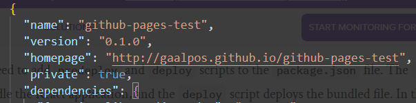
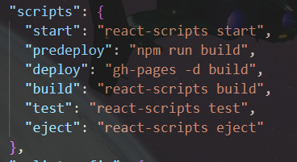

# Deploy React app on Github Pages

https://gaalpos.github.io/github-pages-test/

1.Create your React App.

2.Create your Github repository.

3.Create local repository and add it to remote one:

    git init
    
    git commit -m "first commit"
    
    git branch -M main
    
    git remote add origin https://github.com/{username}/{repo-name}.git

    git push -u origin main

Install gh-pages:

    npm install gh-pages --save-dev

Add this to package.json

    "homepage": "http://{username}.github.io/{repo-name}"

It should look like this: 

Add this to your package.json on scripts{}

    "predeploy" : "npm run build",
    "deploy" : "gh-pages -d build",

It should look like this: 

Push changes to github

    git add .
    git commit -m "setup gh-pages"
    git push

Deploy :

    npm run deploy

Now go to "Pages" on the repository settings. You should see the deploy link there once its fully deployed. 

Enjoy :)

UDPDATE: I think you need to run " npm run deploy" for the web to update after a push. Not sure tho. Anyway i dont think doing that can hurt anything.